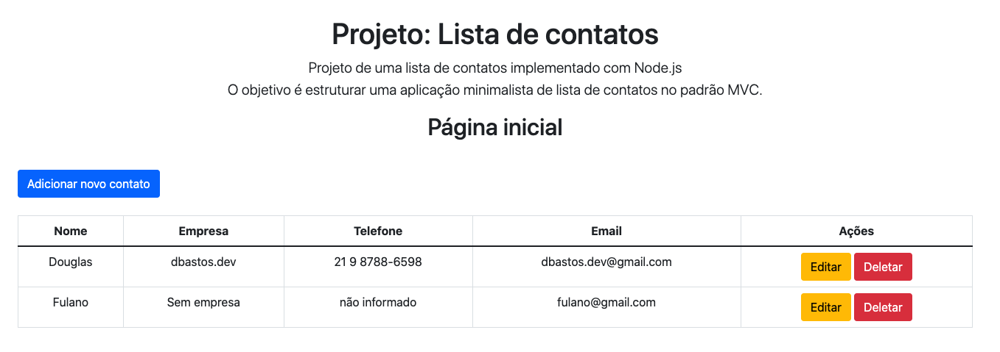
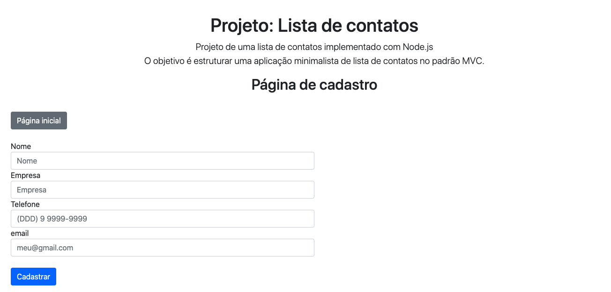

# Projeto Lista de contatos - Node.js

Projeto CRUD de lista de contatos com Node.js e persistência de dados em arquivos JSON. 

Para reforçar o estudo e desenvolvimento de lógica de programação, construí o sistema com base em arquivos json para gerenciar e persistir a base de dados. São dois arquivos separados que se complementam: um JSON para armazenar os ids sequênciais e outro para armazenar os dados cadastrados e operações CRUD. Utilizei a lib do fs, nativa do Node.js para criar os gerenciadores do 'banco de dados'.

Se você é iniciante assim como eu, seguem algumas dicas de como explorar o funcionamento do projeto: 

* Ao finalizar o download do projeto, abra o terminal e acesse o local em que se encontra a pasta com os arquivos;
* Digite os comando: **npm update** no terminal para baixar e instalar as dependências do projeto; 
* Finalizada as instalações, digite no terminal: **npm run dev** para que o servidor seja executado. A applicação está configurada para rodar por default na porta 8082, logo acesse o navegador e digite: **localhost:8082** para ver o projeto funcionando. 

Ficaram pendentes algumas melhorias, como validação de formulário e exibição de outras mensagens de sucesso ou erro. Mas deixarei esse tipo de trabalho para os próximos projetos. 

dependências do projeto: ejs, express e nodemon (dev)

Dúvidas e sugestões, envie para dbastos.dev@gmail.com 
